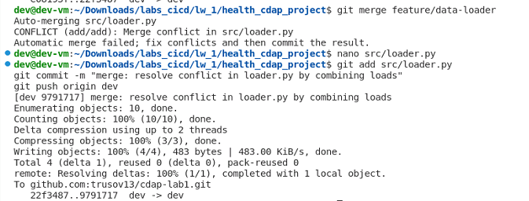
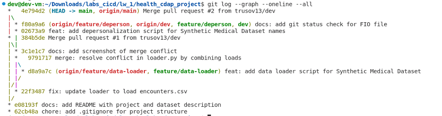

# Corporate Data Analytics Platform (CDAP) - Вариант 29

ФИО: [Трусов Артемий Ильич]  
Группа: [БД-251м]  
Вариант: 29  

## Описание проекта  
Анализ текстов электронных медкарт с обеспечением конфиденциальности используя деперсонализацию (удаление ФИО).  

## Датасет  
Используется Synthetic Medical Dataset (с Kaggle): синтетические медицинские записи, включая patients.csv с именами (FIRST, LAST) и encounters.csv с текстовыми описаниями.  

## Структура проекта  
- /data: сырые данные (CSV-файлы датасета, не в Git)  
- /notebooks: Jupyter notebooks  
- /src: скрипты (loader.py для загрузки, deperson.py для деперсонализации)  

## Merge conflict

Скриншот конфликта при слиянии feature/data-loader в dev:

## Git history

История коммитов после выполнения лабораторной работы:

