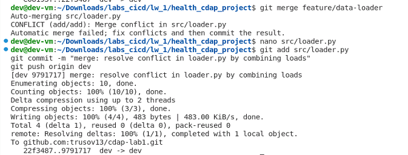
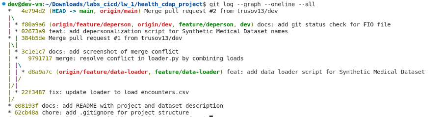

# Corporate Data Analytics Platform (CDAP) - Вариант 29

ФИО: [Трусов Артемий Ильич]  
Группа: [БД-251м]  
Вариант: 29  

## Описание проекта  
Анализ текстов электронных медкарт с обеспечением конфиденциальности используя деперсонализацию (удаление ФИО).  

## Датасет  
Используется Synthetic Medical Dataset (с Kaggle): синтетические медицинские записи, включая patients.csv с именами (FIRST, LAST) и encounters.csv с текстовыми описаниями.  

## Структура проекта  
- /data: сырые данные (CSV-файлы датасета, не в Git)  
- /notebooks: Jupyter notebooks  
- /src: скрипты (loader.py для загрузки, deperson.py для деперсонализации)  

## Merge conflict

Скриншот конфликта при слиянии feature/data-loader в dev:



## Git history

История коммитов после выполнения лабораторной работы:



## Лабораторная работа №2

### Упаковка многокомпонентного аналитического приложения с помощью Docker и Docker Compose

#### Цель работы

Научиться создавать оптимизированные Docker-образы для аналитических
приложений (Python/Data Science стек) и оркестрировать взаимодействие
нескольких сервисов с помощью Docker Compose. В рамках работы
реализована архитектура из нескольких контейнеров: база данных,
ETL-загрузчик данных и аналитическое приложение.

------------------------------------------------------------------------


Схема взаимодействия:

CSV данные → loader (ETL) → PostgreSQL (db) → analytics_app (Streamlit
dashboard)

Все сервисы работают внутри изолированной сети:

backend-network

------------------------------------------------------------------------

## Dockerfile (Best Practices)

Для контейнера аналитического приложения реализован оптимизированный
Dockerfile.

Использованные практики:

-   используется фиксированная версия базового образа (python:3.10-slim)
-   команды RUN объединены для уменьшения количества слоев
-   зависимости устанавливаются до копирования исходного кода (для
    использования кэша Docker)
-   используется непривилегированный пользователь (UID 1000)
-   очищается кэш пакетного менеджера
-   используется файл .dockerignore для исключения лишних файлов

------------------------------------------------------------------------

## Docker Compose

Инфраструктура приложения описана в файле:

docker-compose.yml

Реализованы следующие возможности:

### Сервисы

-   db --- контейнер PostgreSQL
-   loader --- контейнер загрузки данных
-   analytics_app --- контейнер аналитического приложения

### Depends_on

Приложение и загрузчик запускаются только после готовности базы данных.

Используется:

depends_on: db: condition: service_healthy

------------------------------------------------------------------------

## Healthcheck

Для базы данных реализована проверка состояния контейнера.

Пример:

healthcheck: test: \["CMD-SHELL", "pg_isready -U \$POSTGRES_USER"\]
interval: 10s timeout: 5s retries: 5

Контейнер считается готовым только после успешного ответа PostgreSQL.

------------------------------------------------------------------------

## Хранение данных (Volumes)

Для сохранения данных базы используется именованный volume:

volumes: postgres_data:

Это позволяет сохранять данные между перезапусками контейнеров.

------------------------------------------------------------------------

## Конфигурация через .env

Переменные окружения вынесены в файл:

.env

Пример переменных:

POSTGRES_DB=medical POSTGRES_USER=admin POSTGRES_PASSWORD=password
POSTGRES_PORT=5432

Пароли и настройки не захардкожены в docker-compose.yml.

Файл .env добавлен в .gitignore.

------------------------------------------------------------------------

## Техническое задание варианта 29

В соответствии с вариантом 29 (Медкарта --- NLP) реализовано требование:

Использовать command в Docker Compose для переопределения CMD из
Dockerfile и запуска приложения в режиме отладки.

Пример:

command: python app.py --debug

Это позволяет запускать контейнер в различных режимах без изменения
Dockerfile.

------------------------------------------------------------------------

## Запуск проекта

Сборка и запуск контейнеров:

docker compose up --build

Проверка запущенных контейнеров:

docker ps

Остановка контейнеров:

docker compose down

------------------------------------------------------------------------

## Скриншоты работы


------------------------------------------------------------------------
## Лабораторная работа №3

### Оркестрация аналитического приложения в Kubernetes

#### Цель работы

Развернуть многокомпонентное приложение в Kubernetes: Deployment для базы данных и аналитического приложения, Job для одноразовой загрузки данных, Service для доступа, PersistentVolumeClaim для хранения, Secret для учетных данных, ConfigMap для конфигурации.

------------------------------------------------------------------------

Схема взаимодействия:

CSV данные → loader-job → PostgreSQL (Deployment + PVC) → analytics-app (Deployment + Service NodePort)

------------------------------------------------------------------------

## Реализованные Kubernetes-ресурсы

- Deployment: db (PostgreSQL), analytics-app (Streamlit)
- Job: loader-job (ETL-загрузка данных, завершается после выполнения)
- Service: app-service (NodePort 30001), db-service (ClusterIP)
- PersistentVolumeClaim: для сохранения данных PostgreSQL
- Secret: db-secret (учетные данные PostgreSQL)
- ConfigMap: app-config (дополнительные настройки, если используются)

------------------------------------------------------------------------
## Init Container chmod-data

Для корректной работы Streamlit-приложения с непривилегированным пользователем добавлен **init-контейнер** `chmod-data`.

Он выполняет команду:

```yaml
command: ["chmod", "-R", "777", "/app/data"]
```
и гарантирует, что приложение имеет права на запись в смонтированный volume.

## Health probes и готовность

- readinessProbe и livenessProbe для Deployment db и analytics-app
- Job loader завершается успешно (exit code 0) после загрузки данных

------------------------------------------------------------------------

## Запуск и проверка

```bash
# Применить манифесты
kubectl apply -f k8s/

# Посмотреть состояние
kubectl get pods,svc,pvc,job -o wide

# Логи загрузчика
kubectl logs job/loader-job --tail=100

# Логи приложения
kubectl logs -l app=analytics --tail=100

# Получить URL дашборда
minikube service app-service --url
# или открыть: http://<minikube-ip>:30001

Скриншоты работы

Init-контейнер chmod-data — выполнена команда chmod

Список подов: db и analytics-app в статусе Running, loader-job Completed

Логи Job loader — успешная загрузка данных

Работающий Streamlit дашборд в браузере

Вывод kubectl get all или kubectl get pods,svc,pvc,job
